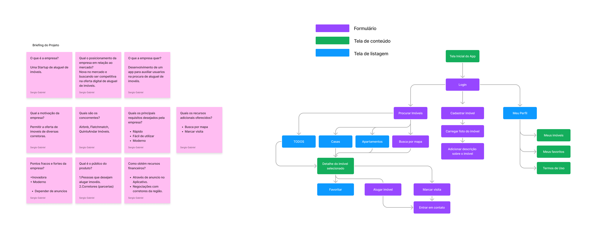

# Prototipagem de interface para plataforma de aluguel de imóveis
UI - Criação de interface gráfica para aplicativo de locação de imóveis (Figma)

Este projeto consistiu na criação da interface gráfica para um aplicativo de aluguel de imóveis. Utilizando a ferramenta Figma, foram desenvolvidos wireframes e protótipos interativos, permitindo a visualização do fluxo de navegação do usuário. Foram criados elementos visuais personalizados, como ícones e paleta de cores, a fim de transmitir a identidade visual da marca. O resultado final é uma interface intuitiva e agradável, que proporciona aos usuários uma experiência satisfatória dentro das suas limitações na busca e locação de imóveis.

## Links figma:
- figjam/briefing: https://www.figma.com/file/ZtMh5otLriEHhIz0ohYJRR/Figjam---Briefing?t=ZVMgYnYao0dQi6MI-0
- Baixa&Média fidelidade: https://www.figma.com/file/AuQCX5drNMwIkqOalNHbM8/Baixa%26Media_Fidelidade?node-id=0%3A1&t=7dSGJEu1QHtnRZZd-0

## Capturas de tela

Aqui estão algumas capturas de tela da interface do usuário:

### Baixa e Média Fidelidade

### Briefing

